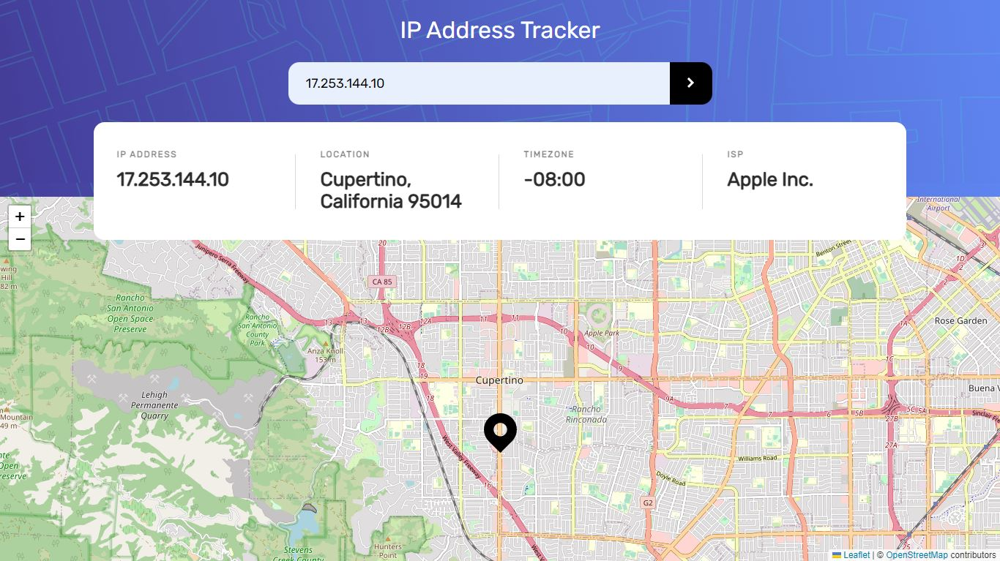

# IP address tracker

This is a solution to the [IP address tracker challenge on Frontend Mentor](https://www.frontendmentor.io/challenges/ip-address-tracker-I8-0yYAH0).

## Table of contents

- [Overview](#overview)
  - [The challenge](#the-challenge)
  - [Screenshot](#screenshot)
- [My process](#my-process)
  - [Built with](#built-with)
  - [What I learned](#what-i-learned)
- [Author](#author)

## Overview

### The challenge

Users should be able to:

- View the optimal layout for each page depending on their device's screen size
- See their own IP address on the map on the initial page load
- Search for any IP addresses or domains and see the key information and location

### Screenshot

## My process

### Built with

- [React](https://reactjs.org/) - JS library
- [ipify](https://www.ipify.org/) - IP Address API
- [leaflet](https://leafletjs.com/) - Maps library
- [Vite](https://vitejs.dev/) - Build tool
- [Prettier](https://prettier.io/) - Code formatter
- [ESLint](https://eslint.org/) - Syntax check

### What I learned

- how to use scss
- basics of work with map library

## Author

- GitHub - [Marek Vcelak](https://github.com/VcelakMarek)
